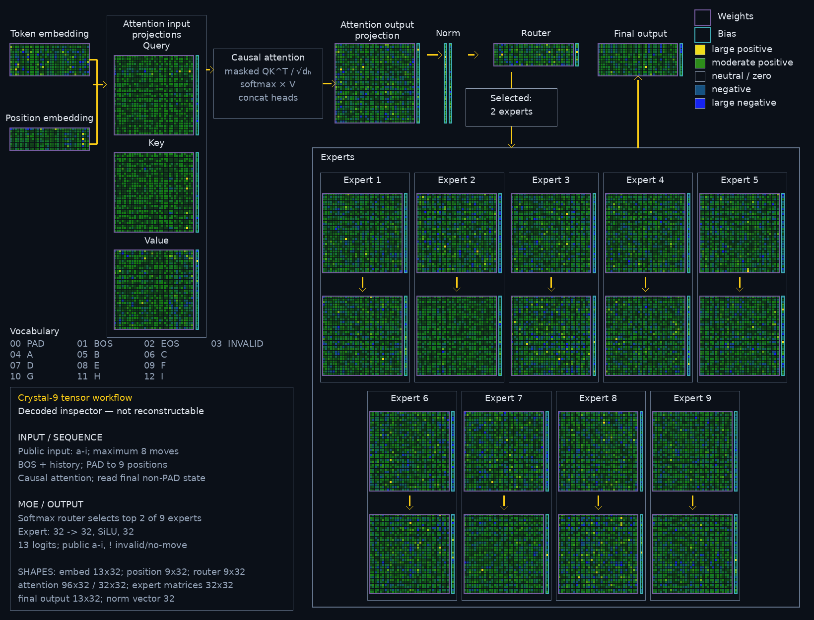

# Crystal-9 Packed INT4 v1

Crystal-9 is a clean-room, local 3×3 tic-tac-toe move-policy experiment. It is a small sparse Mixture-of-Experts policy model: shared token and position embeddings, causal multi-head attention, LayerNorm, a router, nine two-layer experts, and top-2 routing.

This repository package is **not a Transformers checkpoint, GGUF, or Ollama model**. It contains Crystal-9's custom `crystal-9-packed-int4-v1` artifact and the minimal Python runtime required to load it locally.

## Why Crystal-9 followed Palace-9

[Palace-9](https://huggingface.co/lewismoten/palace-9) was the earlier compatibility-focused experiment: a `Qwen2MoeForCausalLM` model shaped for Transformers, llama.cpp, and Ollama chat tooling. That required a general-purpose byte-BPE vocabulary, a 16-token context, and architecture/configuration conventions intended for another model family. Those constraints were useful for proving compatibility, but they were not the most compact fit for a deterministic 3×3 move-history policy.

Crystal-9 uses the same deterministic tic-tac-toe training/evaluation data, but was redesigned around the task: a 32-wide hidden state, nine top-2 routed experts, an eight-move context, a 13-token game vocabulary, and a target of exact packed-INT4 inference. It is intentionally a custom local runtime rather than a llama.cpp/Ollama-compatible model.

| Comparable artifact | Palace-9 | Crystal-9 | Difference |
|---|---:|---:|---:|
| F32 source checkpoint | `model.safetensors` — 2,598,856 B | `artifacts-fp32.pt` — 116,365 B | Crystal-9 is 22.33× smaller |
| Compact accepted deployment | Q4_K_M GGUF — 1,065,216 B | packed INT4 v1 — 46,547 B | Crystal-9 is 22.88× smaller |

The formats are not interchangeable: Palace-9's listed artifacts are Qwen2-MoE/Transformers or GGUF compatibility artifacts, while Crystal-9's compact artifact is a custom packed-INT4 runtime container. The size comparison documents the task-specific design tradeoff, not a claim that either format can load the other.

## Tensor workflow



This is a decoded, non-reconstructable inspection of the full-parameter INT4 QAT checkpoint. It documents the tensor layout and QAT workflow; it is not a release label, model container, or substitute for the packed deployment artifact.

## Accepted deployment artifact

| Property | Value |
|---|---|
| Artifact | `artifacts/crystal-9-int4-group2-packed-v1.pt` |
| Format | `crystal-9-packed-int4-v1` |
| Storage | signed packed INT4 codes with explicit scales |
| Exact policy gate | 0 misses / 294,778 legal histories |
| Invalid input behavior | malformed, repeated-square, oversized, and post-terminal histories return `!` |

The shipped artifact is the accepted original FP32-scale version. `validation/packed-int4-acceptance.json` records the artifact digest and exhaustive policy result.

## Input and output contract

Pass a raw history of board-square letters `a` through `i` in play order, with at most eight moves. The policy returns one square letter for a legal next move, or `!` when the history is invalid or terminal.

The internal vocabulary is `<pad>`, `<bos>`, `<eos>`, `!`, and `a`–`i`. Only `a`–`i` are public input symbols.

## Run locally

Use a current PyTorch installation. From this repository root:

```bash
python3 - <<'PY'
from crystal9 import GameTokenizer
from packed_int4 import PackedInt4Policy

runtime = PackedInt4Policy.load("artifacts/crystal-9-int4-group2-packed-v1.pt").eval()
tokenizer = GameTokenizer.from_design_file("design.json")
print(runtime.predict("ae", tokenizer))
PY
```

Verify the staged release files (every distributable file except `SHA256SUMS` itself):

```bash
sha256sum -c SHA256SUMS
```

This detects changes after the manifest was generated. It is not an authenticated signature: for a hosted release, compare the artifact digest in `release-manifest.json` against a trusted release reference.

## Provenance and scope

- The immutable F32 reference is a source/evaluation baseline and is not included in this compact deployment package.
- The included deployment artifact was independently validated by `PackedInt4Policy`, which consumes the packed representation rather than a training checkpoint.
- The `validation/` reports are evidence for stated claims. They are not a replacement for re-running the runtime gates in your own environment.
- Browser projection files and decoded tensor inspectors are intentionally excluded: they are separate representations and are not required to use this Python runtime.

## INT3 status

INT3 is ongoing, staged research. It is **not included or claimed as a deployment artifact** here. A later INT3 release would require its own packed runtime, integrity gates, and exhaustive acceptance evidence.

## License

License selection is pending repository-owner confirmation. Do not redistribute this staged package until a license file has been added and the hosted release is approved.
